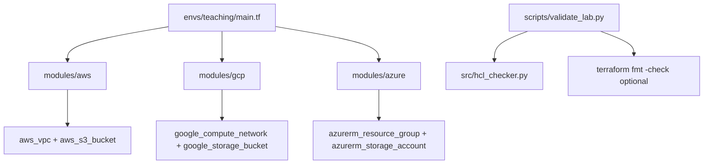
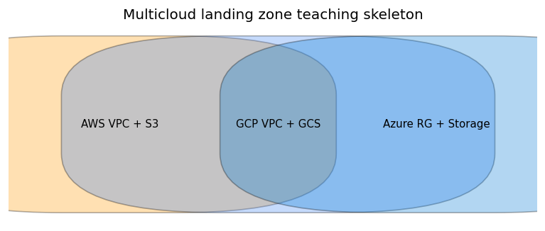

# Terraform Multicloud Landing Zone Lab

**Author:** Faiz Elahi · **Type:** EDUCATIONAL IaC skeleton · **No cloud credentials included**

---

## Educational disclaimer / synthetic data

This repository teaches **structure and validation** of multicloud Terraform layouts. It is **not** a CIS-hardened enterprise landing zone, **not** deployed infrastructure in your name, and **not** proof of production multicloud operations unless you separately document real work.

**Never run `terraform apply`** from this teaching repo unless you deliberately use a personal sandbox, understand billing, and accept full responsibility for cloud charges. Provider blocks are teaching placeholders; `terraform validate` may require provider plugins you install yourself.

`scripts/generate_synthetic_data.py` is a **no-op placeholder** for portfolio consistency with other labs (no datasets in this IaC project).

---

## Problem statement (detailed)

Cloud adoption at scale starts with a **landing zone**: shared VPCs/VNets, logging, identity baselines, and guardrails before application teams deploy workloads. Large organizations often standardize on **Terraform modules** so AWS, Azure, and GCP foundations share naming, tagging, and review processes—even when each cloud’s resources differ.

Students frequently read Terraform docs in isolation without seeing **one repo** that composes multiple cloud modules behind a single **environment root**. This lab provides:

1. A **`envs/teaching/main.tf`** root that calls AWS, GCP, and Azure modules.
2. **Per-cloud modules** with minimal resource skeletons (VPC + bucket patterns).
3. A **validation path** that prefers `terraform fmt -check` when CLI exists, else Python HCL brace checking.

You learn to **read module wiring**, **discuss what is missing** (IAM, backends, SCPs), and **validate without applying**—the safe default for classrooms.

---

## Why this tool

| Need | Why Terraform here |
|------|---------------------|
| Repeatable foundations | Modules encode standards once, reuse per env |
| Code review culture | `.tf` files diff in PRs like application code |
| Multicloud vocabulary | Side-by-side AWS/GCP/Azure resource names |
| Interview storytelling | Explain composition roots vs leaf modules |

Alternatives (click-ops in three consoles) do not teach **state**, **module sources**, or **fmt discipline**.

---

## Architecture





Details: [`docs/architecture.md`](docs/architecture.md)

---

## Dataset dictionary

**Not applicable** — this is infrastructure-as-code only. There are no analytic tables. The placeholder generator exists so the portfolio lab set shares a familiar `scripts/generate_synthetic_data.py` entrypoint pattern.

---

## Prerequisites

- **Python 3.10+** for `scripts/validate_lab.py` and `src/hcl_checker.py`
- **Optional:** Terraform CLI installed and on `PATH` for `terraform fmt -check -recursive`
- **Optional:** Provider plugins if you choose to run `terraform init` in a personal sandbox (not required for this lab’s default validate-only path)

---

## Step-by-step: how to run

### Windows PowerShell

```powershell
cd terraform-multicloud-landing-zone-lab
python -m venv .venv
.\.venv\Scripts\Activate.ps1
pip install -r requirements.txt
python scripts/render_docs_images.py
python scripts/validate_lab.py
```

### Optional bash

```bash
cd terraform-multicloud-landing-zone-lab
python3 -m venv .venv && source .venv/bin/activate
pip install -r requirements.txt
python scripts/render_docs_images.py
python scripts/validate_lab.py
```

### If Terraform CLI is installed

Validation script attempts:

```text
terraform fmt -check -recursive
```

When Terraform is missing, validation falls back to **`src/hcl_checker.py`** (balanced braces across `.tf` files).

### Explicitly avoid (unless self-directed sandbox)

```powershell
# DO NOT run in classroom default mode:
# cd envs/teaching
# terraform init
# terraform apply
```

---

## File-by-file walkthrough

| Path | Role |
|------|------|
| `envs/teaching/main.tf` | Root module composing `aws_landing`, `gcp_landing`, `azure_landing`; exposes outputs |
| `modules/aws/main.tf` | Teaching VPC + S3 bucket skeleton |
| `modules/gcp/main.tf` | Teaching VPC network + GCS bucket skeleton |
| `modules/azure/main.tf` | Resource group + storage account skeleton |
| `src/hcl_checker.py` | Lightweight structural HCL sanity check |
| `scripts/validate_lab.py` | Orchestrates fmt check and/or HCL checker |
| `scripts/render_docs_images.py` | Regenerates architecture PNG |
| `scripts/generate_synthetic_data.py` | No-op placeholder |
| `.gitignore` | Excludes local `.tfstate` and secrets |

**Teaching flow:** read root → open each module → list missing enterprise controls → run validate script.

---

## Expected outputs and how to interpret them

| Output | Meaning |
|--------|---------|
| `validate_lab.py` exit code 0 | Format/HCL checks passed |
| stdout from fmt | Lists files needing format if check fails |
| `docs/images/multicloud_skeleton.png` | Slide-ready diagram |

No AWS/GCP/Azure resources are created by the default lab path.

---

## Results interpretation

Passing validation means **syntax/format discipline**, not security compliance. Use classroom time to enumerate gaps: **remote state**, **IAM least privilege**, **CloudTrail/Activity Log**, **KMS encryption**, **network egress controls**, **tag policies**.

The GCP module uses a teaching `project_id` string (`faiz-elahi-teaching-lab`)—replace with your sandbox project if you ever init providers.

---

## Glossary (8+ terms)

1. **Landing zone** — Baseline cloud foundation (network, identity, logging) before app workloads.
2. **Module** — Reusable Terraform package with inputs, outputs, and resources.
3. **Root module** — Entry configuration in `envs/teaching` that calls child modules.
4. **State** — Terraform’s mapping of resources to reality; must be remote + locked in teams.
5. **Provider** — Plugin binding Terraform to AWS, Azure, GCP APIs.
6. **fmt** — Canonical formatting (`terraform fmt`) to reduce noisy diffs.
7. **Backend** — Where state files live (S3 + DynamoDB lock, etc.).
8. **Composition** — Wiring modules together at an environment layer.
9. **Guardrails** — SCPs, policies, and org-level constraints—not present in this skeleton.
10. **Outputs** — Exported values (e.g., `aws_vpc_id`) for downstream stacks.

---

## Common mistakes (5+)

1. Running **`terraform apply`** with global bucket names that must be globally unique (S3/GCS collisions).
2. **Committing `.tfstate`** containing secrets or resource IDs from personal sandboxes.
3. Claiming this skeleton equals a **CIS-compliant enterprise landing zone**.
4. Assuming **`terraform validate` works offline** without provider initialization—may need `init` in real use.
5. **Hard-coding credentials** in `.tf` files instead of environment-based auth.
6. Ignoring **separate state per environment** (dev/test/prod).

---

## Exercises (5+)

1. Add a commented **`backend "s3"`** block with teaching notes (do not apply without sandbox).
2. Create **`variables.tf`** at root for consistent tags (e.g., `Owner`, `Environment`).
3. Draw **IAM trust boundaries** per cloud module on paper or in `docs/architecture.md`.
4. Add **module outputs** for bucket names and discuss sensitivity in CI logs.
5. Implement a **`terraform-docs`** markdown table for inputs/outputs.
6. Compare this layout to **`aws-health-finance-lake-lab`** / **`azure-health-data-platform-lab`** sibling narratives.

---

## Limitations / simulation vs production

| This lab | Production landing zone |
|----------|-------------------------|
| Validate/fmt only | Planned applies, drift detection |
| Minimal resources | Hub-spoke networking, firewall rules |
| No IAM matrix | Role factory, SSO integration |
| Local state ignored in git | Remote state + locking |
| Teaching project IDs | Real org hierarchy, folders, accounts |

Provider blocks may not be fully wired for **`terraform validate`** without installing plugins—this lab focuses on **readable module structure** and safe validation habits.

---

## Related labs

- [`aws-health-finance-lake-lab`](../aws-health-finance-lake-lab/) — AWS data lake concepts.
- [`azure-health-data-platform-lab`](../azure-health-data-platform-lab/) — Azure health data patterns.
- [`gcp-data-platform-lab`](../gcp-data-platform-lab/) — GCP data platform sketch.
- [`oci-data-platform-lab`](../oci-data-platform-lab/) — OCI teaching layout.
- [`prefect-orchestration-lab`](../prefect-orchestration-lab/) — Orchestration after infrastructure exists.

---

**Author:** Faiz Elahi · Educational skeleton only.
